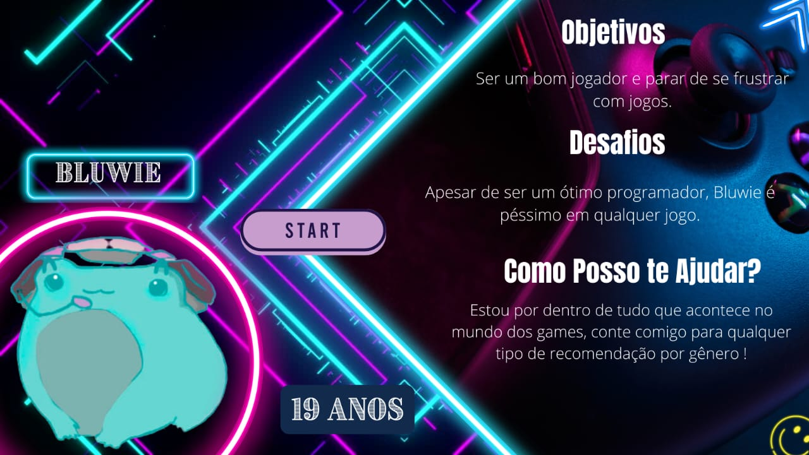
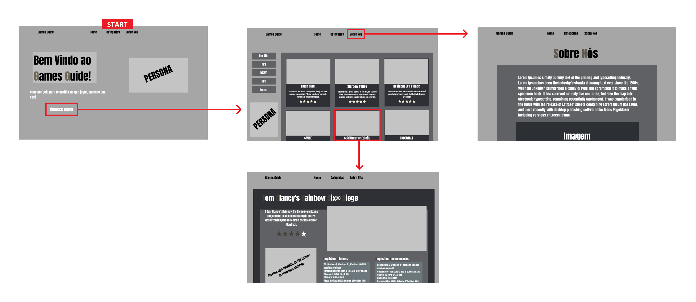
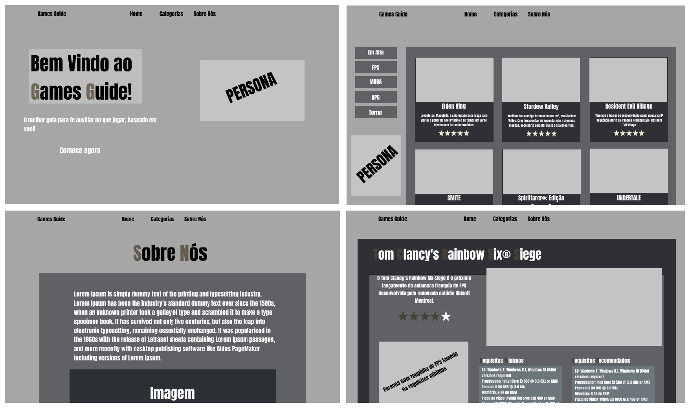

# Informações do Projeto
`TÍTULO DO PROJETO`  

Games Guide

`CURSO` 

Sistemas de Informaçao

## Participantes

- Heitor Freitas Fernandes
- Leonardo Araujo de Oliveira
- Maria Luisa Couto Fernandes
- Matheus Gabriel Gonçalves Cunha de Oliveira
- Mayara Aya Kimura
- Víctor Henrique Cutrim Silva

# Estrutura do Documento

- [Informações do Projeto](#informações-do-projeto)
  - [Participantes](#participantes)
- [Estrutura do Documento](#estrutura-do-documento)
- [Introdução](#introdução)
  - [Problema](#problema)
  - [Objetivos](#objetivos)
  - [Justificativa](#justificativa)
  - [Público-Alvo](#público-alvo)
- [Especificações do Projeto](#especificações-do-projeto)
  - [Personas e Mapas de Empatia](#personas-e-mapas-de-empatia)
  - [Histórias de Usuários](#histórias-de-usuários)
  - [Requisitos](#requisitos)
    - [Requisitos Funcionais](#requisitos-funcionais)
    - [Requisitos não Funcionais](#requisitos-não-funcionais)
  - [Restrições](#restrições)
- [Projeto de Interface](#projeto-de-interface)
  - [User Flow](#user-flow)
  - [Wireframes](#wireframes)
- [Metodologia](#metodologia)
  - [Divisão de Papéis](#divisão-de-papéis)
  - [Ferramentas](#ferramentas)
  - [Controle de Versão](#controle-de-versão)
- [**############## SPRINT 1 ACABA AQUI #############**](#-sprint-1-acaba-aqui-)
- [Projeto da Solução](#projeto-da-solução)
  - [Tecnologias Utilizadas](#tecnologias-utilizadas)
  - [Arquitetura da solução](#arquitetura-da-solução)
- [Avaliação da Aplicação](#avaliação-da-aplicação)
  - [Plano de Testes](#plano-de-testes)
  - [Ferramentas de Testes (Opcional)](#ferramentas-de-testes-opcional)
  - [Registros de Testes](#registros-de-testes)
- [Referências](#referências)

# Introdução

## Problema

A grande variedade de jogos disponíveis atualmente é maravilhosa, não obstante pode ser ao 
mesmo tempo bem assustadora, principalmente para pessoas que estão indecisas sobre com qual título, 
dentre os vários presentes no mercado, irão gastar seu tempo e dinheiro.  

## Objetivos

Idealizamos uma aplicação web, um site que reunisse as principais recomendações de jogos em 
alta, separando-os por categoria, trazendo informações gerais sobre cada título ofertado, além de suas 
especificações e requisitos de sistema. Dessa forma, poderiamos tranquilizar o futuro usuário, pois o 
mesmo saberia se o jogo escolhido funcionaria da forma coesa em sua máquina.

## Justificativa

Grande parte das pessoas que estão procurando o que jogar ficam indecisas por conta da grande quantidade de jogos no mercado, a criação de uma ferramenta que direcione o usuário ao seu objetivo facilitaria o processo por parte do usuário, proporcionando um grande ganho de tempo, além também de exibir as informações sobre o jogo para o usuário, como as avaliações, especificações e a sua descrição, permitindo uma maior certeza sobre o que escolher.

## Público-Alvo

O público-alvo principal seria jovens de 12 à 25 anos. O projeto do site Games Guide (GG!) é sobre um espaço voltado para jogos de mídias digitais, onde o público alvo teria acesso a recomendações sobre quais jogos jogar de acordo com suas respectivas avaliações, além de especificações de requisitos mínimos de sistema.

# Especificações do Projeto

A elaboração da persona e do mapa de empatia foi realizada com base em pesquisas feitas pelos integrantes do grupo, com as informações adquiridas o foi estabelecida uma média para a criação das caracteristicas da persona. O processo foi realizado pelo *Discord* e por encontros pós aulas.

## Personas e Mapas de Empatia

**O que ele pensa e sente?** Ele quer ser melhor em jogos. O que mais o preocupa é que, apesar 
de  possuir  uma  excelente  carreira,  não  consegue  se  divertir  o  suficiente  por  não  ser  um  bom 
gamer.

**O que ele escuta?** Apesar de estar feliz e relativamente satisfeito com a sua vida, as pessoas ao 
seu redor esperam que ele saia mais de casa, faça mais amigos e vá “curtir o momento”, 
visitando novos lugares, indo para festas, conhecendo novas pessoas etc.

**O que ele vê?** Prefere interagir com informações de cunho tecnológico, não se atentando muito 
às notícias sobre atualidade e possui uma vida social “pequena”.

**O que ele fala e faz?** Fora do seu círculo profissional, gosta de vestir roupas com estamparias 
de jogos e animes. É um(a) ¿pessoa? ¿sapo? tranquila(o), procura não expressar muito quando 
está chateado/estressado, tenta ao máximo transmitir essa sensação às pessoas ao seu redor.

**Quais  são  as  dores?**  Ele  se  chateia  muito  por  não  conseguir  jogar  bem,  apesar  de  desde 
criança ter contato com o “mundo tecnológico”. Sem falar sobre hobbies, um de seus maiores 
medos é se encontrar em uma profissão onde não exerça o que realmente ama: 
desenvolvimento, e onde também não possa mostrar suas competências.

**Quais são os objetivos?** Ele almeja sempre o sucesso profissional. Consegue se enturmar bem 
com  seus  colegas  de  equipe,  pretende  ter  uma  estabilidade  financeira  cada  vez  maior  para 
conhecer alguns países que possuem cultura gamer/geek.

## Histórias de Usuários

Com base na análise das personas forma identificadas as seguintes histórias de usuários:

|EU COMO... `PERSONA`| QUERO/PRECISO ... `FUNCIONALIDADE` |PARA ... `MOTIVO/VALOR`                 |
|--------------------|------------------------------------|----------------------------------------|
|Usuário do sistema  | Recomendações de jogos com reviews sinceras | Encontrar o que jogar mais rapidamente e com base em avaliações |
|Usuário do sistema  | Encontrar facilmente as configurações necessarias para cada jogo | Não perder tempo procurando os requisitos de cada jogo |
|Usuário do sistema  | Achar jogos com base na categoria | Encontrar jogos que gosta mais rapidamente |

## Requisitos

As tabelas que se seguem apresentam os requisitos funcionais e não funcionais que detalham o escopo do projeto.

### Requisitos Funcionais

|ID    | Descrição do Requisito  | Prioridade |
|------|-----------------------------------------|----|
|RF-001| Nosso site oferecerá recomendações de jogos | ALTA | 
|RF-002| Todos os jogos terão avaliações de acordo com uma média retirada das principais mídias de crítica Geek | ALTA | 
|RF-003| Nosso site oferecerá recomendações de peças para computador de acordo com cada jogo | ALTA | 
|RF-004| Nossos usuários terão a opção de se cadastrar no site, com o intuito de receber benefícios | MÉDIA | 
|RF-005| Nossos usuários poderão filtrar os jogos por categorias | ALTA | 

### Requisitos não Funcionais

|ID     | Descrição do Requisito  |Prioridade |
|-------|-------------------------|----|
|RNF-001| Por ser uma aplicação web, o sistema deve ser multiplataforma – Windows, Linux e macOs | ALTA | 
|RNF-002| O seu desenvolvimento dese ser em linguagem HTML, CSS e JavaScript | ALTA | 
|RNF-003| O site deve ser fluido e dinâmico | ALTA | 
|RNF-004| O site deve ser claro para todos os usuários | ALTA | 
|RNF-005| O site deve ser compatível com computadores, smartphones e televisões  | ALTA | 

## Restrições

O projeto está restrito pelos itens apresentados na tabela a seguir.

|ID| Restrição                                             |
|--|-------------------------------------------------------|
|01| O projeto deverá ser entregue até o final do semestre |
|02| Não pode ser desenvolvido um módulo de backend        |

# Projeto de Interface

O site games guide conta com uma interface simples e objetiva, entendemos que o usuário não pode fazer esforço para entender a dinâmica do site portanto o grupo pensou em uma interface clara e objetiva, botões auto-explicativos e um fluxo simples para facilitar a utilização da ferramenta.

## User Flow

## Wireframes

# Metodologia

Nessa seção será especificado sobre a metodoloiga adotada pelo grupo durante a execução da sprint 1, além também de demonstrar o processo de Design Thinking, detalhando a divisão de papéis, as ferramentas utilizadas e como foi aplicado o controle de versão.

## Divisão de Papéis

Durante toda a duração da primeira sprint, todos os integrantes do grupo fizeram as tarefas em conjunto.

- Ideação do que seria necessário para o site
- Entrevistas com pelo menos 4 pessoas para cada integrante
- Confecção da Matriz CSD
- Confecção das escalas de cinza, sendo a melhor decidida por meio de votação
- Encontros após as aulas e Calls realizadas pelo discord, com o intuito de retirar dúvidas e organizar as atividades

É válido ressaltar que a partir das próximas sprints, utilizaremos a plataforma de gestão 
Trello, para dividir nossas tarefas e controlar de forma mais eficiente nossas atividades e 
prioridades.

## Ferramentas

| Ambiente  | Plataforma              |Link de Acesso |
|-----------|-------------------------|---------------|
|Processo de Design Thinkgin e Comunicação | Discord | Sem link de acesso | 
|Repositório de código | GitHub | https://github.com/PBE-TIAW-2022-1/tiaw-pbe-20221-matheusfnl.git | 
|Protótipo Interativo | Figma | https://www.figma.com/file/FLrGJQZYwt2yhz74lpSFdt/Games-Guide-Prototype-(Copy)?node-id=0%3A1 | 
|Editor de código | Visual Studio Code | Sem link de acesso | 

## Controle de Versão

A ferramenta de controle de versão escolhida foi o próprio Git, sendo o próprio github o responsável pela hospedagem do repositório. 

Por conta da sprint 1 ser mais "simples" em relação ao código do que as outras, foi designado apenas uma pessoa para enviar o código, portanto não foi necessário a definição de nenhum cargo e nenhuma tag dentro do projeto.

Em relação as outras sprints foi decidido o uso das seguintes tags:
- bugfix - funcionalidade com problemas.
- aprimorar - funcionalidade precisa ser melhorada. 
- feature - nova funcionalidade a ser implementada.

Em relação às branchs, seguiremos o padrão estabelecido.
- master - versão estável já testada do software
- unstable - versão já testada do software, porém instável
- testing - versão em testes do software
- dev - versão de desenvolvimento do software

# **############## SPRINT 1 ACABA AQUI #############**

# Projeto da Solução

......  COLOQUE AQUI O SEU TEXTO ......

## Tecnologias Utilizadas

......  COLOQUE AQUI O SEU TEXTO ......

> Descreva aqui qual(is) tecnologias você vai usar para resolver o seu
> problema, ou seja, implementar a sua solução. Liste todas as
> tecnologias envolvidas, linguagens a serem utilizadas, serviços web,
> frameworks, bibliotecas, IDEs de desenvolvimento, e ferramentas.
> Apresente também uma figura explicando como as tecnologias estão
> relacionadas ou como uma interação do usuário com o sistema vai ser
> conduzida, por onde ela passa até retornar uma resposta ao usuário.
> 
> Inclua os diagramas de User Flow, esboços criados pelo grupo
> (stoyboards), além dos protótipos de telas (wireframes). Descreva cada
> item textualmente comentando e complementando o que está apresentado
> nas imagens.

## Arquitetura da solução

......  COLOQUE AQUI O SEU TEXTO E O DIAGRAMA DE ARQUITETURA .......

> Inclua um diagrama da solução e descreva os módulos e as tecnologias
> que fazem parte da solução. Discorra sobre o diagrama.
> 
> **Exemplo do diagrama de Arquitetura**:
> 
> 

# Avaliação da Aplicação

......  COLOQUE AQUI O SEU TEXTO ......

> Apresente os cenários de testes utilizados na realização dos testes da
> sua aplicação. Escolha cenários de testes que demonstrem os requisitos
> sendo satisfeitos.

## Plano de Testes

......  COLOQUE AQUI O SEU TEXTO ......

> Enumere quais cenários de testes foram selecionados para teste. Neste
> tópico o grupo deve detalhar quais funcionalidades avaliadas, o grupo
> de usuários que foi escolhido para participar do teste e as
> ferramentas utilizadas.
> 
> **Links Úteis**:
> - [IBM - Criação e Geração de Planos de Teste](https://www.ibm.com/developerworks/br/local/rational/criacao_geracao_planos_testes_software/index.html)
> - [Práticas e Técnicas de Testes Ágeis](http://assiste.serpro.gov.br/serproagil/Apresenta/slides.pdf)
> -  [Teste de Software: Conceitos e tipos de testes](https://blog.onedaytesting.com.br/teste-de-software/)

## Ferramentas de Testes (Opcional)

......  COLOQUE AQUI O SEU TEXTO ......

> Comente sobre as ferramentas de testes utilizadas.
> 
> **Links Úteis**:
> - [Ferramentas de Test para Java Script](https://geekflare.com/javascript-unit-testing/)
> - [UX Tools](https://uxdesign.cc/ux-user-research-and-user-testing-tools-2d339d379dc7)

## Registros de Testes

......  COLOQUE AQUI O SEU TEXTO ......

> Discorra sobre os resultados do teste. Ressaltando pontos fortes e
> fracos identificados na solução. Comente como o grupo pretende atacar
> esses pontos nas próximas iterações. Apresente as falhas detectadas e
> as melhorias geradas a partir dos resultados obtidos nos testes.

# Referências

......  COLOQUE AQUI O SEU TEXTO ......

> Inclua todas as referências (livros, artigos, sites, etc) utilizados
> no desenvolvimento do trabalho.
> 
> **Links Úteis**:
> - [Formato ABNT](https://www.normastecnicas.com/abnt/trabalhos-academicos/referencias/)
> - [Referências Bibliográficas da ABNT](https://comunidade.rockcontent.com/referencia-bibliografica-abnt/)